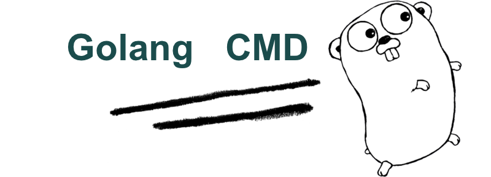
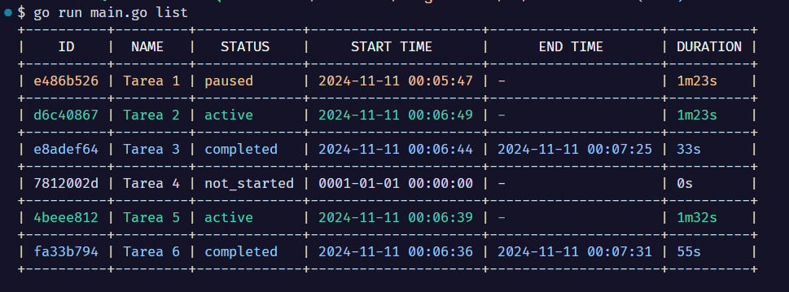

# Aprendiendo Golang con proyectos

Este fin de semana me lo pasé disfrutando, sufriendo, llorando y aprendiendo mientras intentaba avanzar con un mini proyecto personal hecho en Go ([Golang](https://go.dev/)). La verdad, no lo pasé mal, pero al estar recién aprendiendo lo básico de la sintaxis del lenguaje, se vuelve un poco frustrante querer hacer cosas más avanzadas de lo que mi conocimiento actual me permite.

Estoy intentando aprender Go, y sé que hay libros, recursos en internet, excelentes canales de YouTube, y además todo el mundo recomienda siempre hacer el [A Tour of Go](https://go.dev/tour/list) (el tutorial que está en la página oficial) para aprender Go. Pero esta vez quiero hacer algo diferente: quiero guiar mi aprendizaje construyendo cosas.

Si bien el proyecto que elegí es algo sumamente sencillo, quería intentar aprender del proceso haciéndolo educativo y, a la vez, obtener algo funcional como resultado. Por eso estoy intentando construir una app CLI para poder trackear las tareas que voy haciendo en el día y que me permita ver el tiempo que me lleva cada una. 

En sí, la aplicación es sencilla: es una CLI a la que se le puede definir un PATH donde la app creará un archivo JSON para almacenar los datos de nuestras tareas. Se pueden agregar tareas, iniciarlas, pausarlas, detenerlas, borrarlas y listarlas. Lo sé, parece un CRUD común y corriente, pero al ser una CLI, le agrega algo de mística tener que usar comandos y flags para mostrar las salidas de la app.

Para desarrollarlo por el momento solo estoy usando la librería standard de Go y Cobra, que es una librería especifica para crear CLIs de forma más orgánica y que facilita la implementación de algunas funcionalidades.  

Estoy super conforme de lo que he logrado hasta el momento. El fin de este proyecto es poder usar la sintaxis básica de Go, poder adaptarme a la estructura de paquetes, importaciones de métodos y no asfixiarme con cosas muy complicadas. Dejemos que lo complejo sean los conceptos, no los ejercicios para practicarlos. 😁 

En el futuro me gustaría explorar algunas librerías como [Bubble Tea](https://github.com/charmbracelet/bubbletea) para poder mejorar la UI de la aplicación. También sería importante agregarle más flags a algunos comandos, para poder mejorar algunas de las funcionalidades que por el momento son bastante rudimentarias.

Espero poder terminarla pronto, y una vez que eso pase puede que me anime a escribir un poco sobre como la hice y que cosas tuve en cuenta a la hora de desarrollarla. Si a alguien le sirve bienvenido sea, y si no, bueno al menos me sirve a mi para fijar lo que voy aprendiendo. 

Gracias por leer.

Hasta la próxima!

### Referencias
 - Go official Tutorial - [A Tour of Go](https://go.dev/tour/list)
 - Book to build CLI apps - [Powerful Command-Line Applications in Go: Build Fast and Maintainable Tools](https://www.amazon.com/Powerful-Command-Line-Applications-Go-Maintainable/dp/168050696X)
 - Official Cobra documentation - [Cobra CLI Documentation](https://github.com/spf13/cobra)
